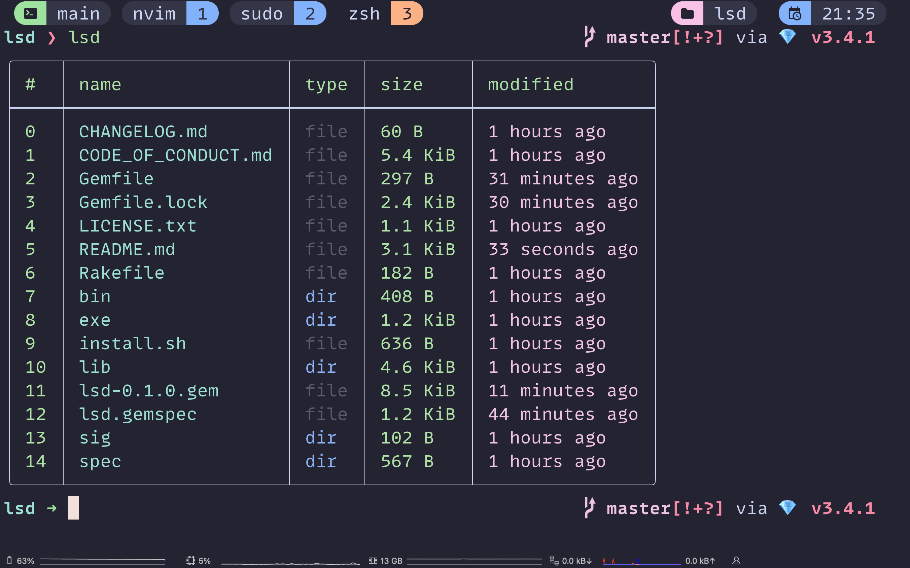

# LSD

A modern alternative to the `ls` command inspired by Nushell's output, written in Ruby.

<p align="center">
  
</p>

## Features

- Tabular output with colors
- Column filtering via command line
- High performance through lazy loading
- Mac and Linux support

## Installation

1. Install gem (recommended)

```bash
gem install lsd-rb
```

2. Use the installation script

```bash
git clone https://github.com/aristotelesbr/lsd
cd lsd
./install.sh
```

3. Manual installation

The installation script will:

1. Check if Ruby is installed (>= 3.0)
2. Install necessary dependencies

   ```bash
   bundle install
   ```

3. Compile the program if needed

   ```bash
   chmod +x bin/lsd
   ```

4. Move the binary to `/usr/local/bin`

## Usage

```bash
# List current directory
lsd

# List a specific directory
lsd ~/Downloads

# Filter by name and type only
lsd --filter-by "name,type"

# Show help
lsd --help
```

## Available Columns

- name: File/directory name
- size: Size in human format (KB, MB, etc)
- type: File type (file, directory, symlink)
- modified: Modification date

The index column (#) is always shown.

## Project Structure

```
.
├── bin/
│   └── lsd         # Main executable
├── lib/
│   ├── lsd.rb      # Main code
│   ├── entry.rb    # Directory entry class
│   └── formatter.rb # Table formatting
├── install.sh      # Installation script
└── README.md       # This documentation
```

## Development

After checking out the repo, run `bin/setup` to install dependencies. Then, run `rake spec` to run the tests. You can also run `bin/console` for an interactive prompt that will allow you to experiment.

To install this gem onto your local machine, run `bundle exec rake install`. To release a new version, update the version number in `version.rb`, and then run `bundle exec rake release`, which will create a git tag for the version, push git commits and the created tag, and push the `.gem` file to [rubygems.org](https://rubygems.org).

## Contributing

We welcome contributions to LSD! Here's how you can help:

1. Fork the project
2. Create your feature branch (`git checkout -b feature/amazing-feature`)
3. Make your changes
4. Run the tests to ensure everything passes (`bundle exec rake`)
5. Commit your changes (`git commit -am 'Add amazing feature'`)
6. Push to the branch (`git push origin feature/amazing-feature`)
7. Create a new Pull Request

### Code Style

This project follows [Ruby Standard Style](https://github.com/standardrb/standard). All pull requests must pass style checks before they can be merged. You can automatically fix most style issues with:

```bash
bundle exec rake standard:fix
```

### Test Coverage

We maintain high test coverage in this project. All new features or bug fixes should include tests. Current test coverage is 90%.

To run the test suite with coverage report:

```bash
bundle exec rake
```

The coverage report will be generated in the `coverage` directory.

### Pull Request Process

1. Ensure your code follows the project's style guide (Ruby Standard)
2. Update the CHANGELOG.md with details of your changes
3. Include tests for your changes
4. Update documentation if needed
5. The PR template will guide you through the required information

## License

The gem is available as open source under the terms of the [MIT License](https://opensource.org/licenses/MIT).

## Code of Conduct

Everyone interacting in the LSD project's codebases, issue trackers, chat rooms and mailing lists is expected to follow the [code of conduct](https://github.com/aristotelesbr/lsd/blob/master/CODE_OF_CONDUCT.md).

