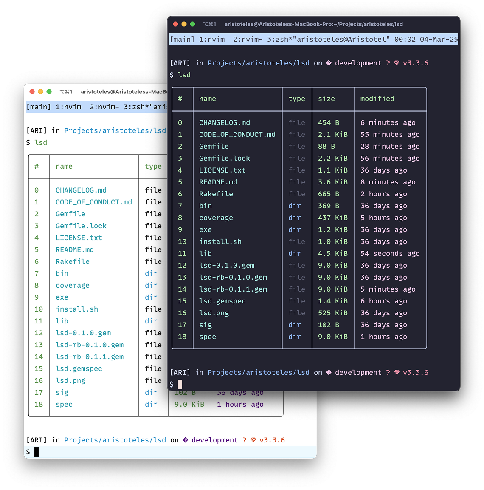

# LSD

A modern alternative to the `ls` command inspired by Nushell's output, written in Ruby.

<p align="center">
  
</p>

## Features

- Tabular output with colors
- Column filtering via command line
- High performance through lazy loading
- Mac and Linux support

## Installation

1. Install gem (recommended)

```bash
gem install lsd
```

2. Use the installation script

```bash
git clone https://github.com/your-username/lsd
cd lsd
./install.sh
```

3. Manual installation

The installation script will:

1. Check if Ruby is installed (>= 3.0)
2. Install necessary dependencies
   ```bash
   $ bundle install
   ```
3. Compile the program if needed
   ```bash
   $ chmod +x bin/lsd
   ```
4. Move the binary to `/usr/local/bin`

## Usage

```bash
# List current directory
lsd

# List a specific directory
lsd ~/Downloads

# Filter by name and type only
lsd --filter-by "name,type"

# Show help
lsd --help
```

## Available Columns

- name: File/directory name
- size: Size in human format (KB, MB, etc)
- type: File type (file, directory, symlink)
- perms: Unix permissions format
- owner: Owner
- modified: Modification date

The index column (#) is always shown.

## Project Structure

```
.
├── bin/
│   └── lsd         # Main executable
├── lib/
│   ├── lsd.rb      # Main code
│   ├── entry.rb    # Directory entry class
│   └── formatter.rb # Table formatting
├── install.sh      # Installation script
└── README.md       # This documentation
```

## Contributing

1. Fork the project
2. Create your feature branch (`git checkout -b feature/new-feature`)
3. Commit your changes (`git commit -am 'Add new feature'`)
4. Push to the branch (`git push origin feature/new-feature`)
5. Create a Pull Request

## License

This project is licensed under the MIT License - see the LICENSE file for details.

## Development

After checking out the repo, run `bin/setup` to install dependencies. Then, run `rake spec` to run the tests. You can also run `bin/console` for an interactive prompt that will allow you to experiment.

To install this gem onto your local machine, run `bundle exec rake install`. To release a new version, update the version number in `version.rb`, and then run `bundle exec rake release`, which will create a git tag for the version, push git commits and the created tag, and push the `.gem` file to [rubygems.org](https://rubygems.org).

## Contributing

Bug reports and pull requests are welcome on GitHub at https://github.com/[USERNAME]/lsd. This project is intended to be a safe, welcoming space for collaboration, and contributors are expected to adhere to the [code of conduct](https://github.com/[USERNAME]/lsd/blob/master/CODE_OF_CONDUCT.md).

## License

The gem is available as open source under the terms of the [MIT License](https://opensource.org/licenses/MIT).

## Code of Conduct

Everyone interacting in the Lsd project's codebases, issue trackers, chat rooms and mailing lists is expected to follow the [code of conduct](https://github.com/[USERNAME]/lsd/blob/master/CODE_OF_CONDUCT.md).
